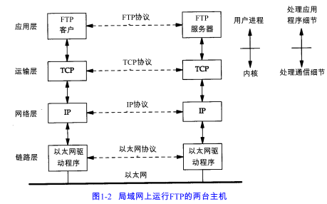
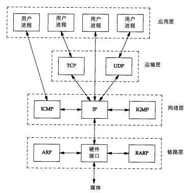
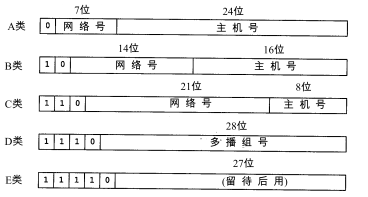
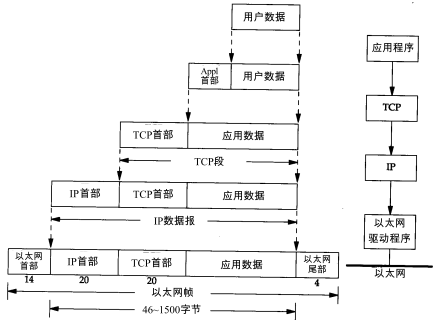
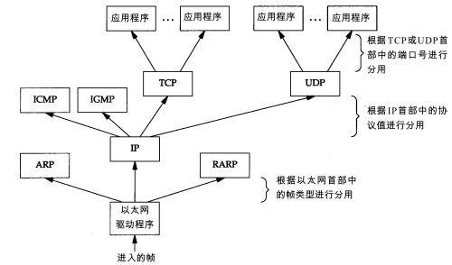

# 1.2 分层

|      | 作用               | 例子                 |
| ---- | ---------------- | ------------------ |
| 应用层  | 处理特定的应用程序细节      | Telnet、FTP和e-mail等 |
| 运输层  | 为主机的应用程序提供端到端的通信 | TCP和UDP            |
| 网络层  | 处理分组在网络中的活动      | IP、ICMP、IGMP       |
| 链路层  | 处理与电缆的物理接口细节     | 设备驱动程序及接口          |

大多数的网络应用程序都被设计成客户 - 服务器模式。应用程序是一个用户进程，下三层工作在内核中。下三层对应用程序一无所知，但它们要处理所有的通信细节。

网络层IP提供的是一种不可靠的服务。也就是说，它只是尽可能快地把分组从源结点送到目的结点，但是并不提供任何可靠性保证。而另一方面，TCP在不可靠的IP层上提供了一个可靠的运输层。为了提供这种可靠的服务，TCP采用了超时重传、发送和接收端到端的确认分组等机制。

构造互联网最简单的方法是使用路由器，它可以为不同类型的物理网络提供链接：以太网、令牌环网、点对点的链接和FDDI（光钎分布式数据接口）等等。

连接网络的另一个途径是使用网桥。网桥是在链路层上对网络进行互连，而路由器则是在网络层上对网络进行互连。网桥使得多个局域网（LAN）组合在一起，这样对上层来说就好像是一个局域网。

# 1.3 TCP/IP的分层

ICMP是IP协议的附属协议，IP层用它来与其他主机或路由器交换错误报文和其他重要信息。

# 1.4 互联网的地址

互联网上的每个接口必须有一个唯一的Internet地址（也称作IP地址）。IP地址长32bit。

| 类型   | 范围                          |
| :--- | --------------------------- |
| A    | 0.0.0.0 - 127.255.255.255   |
| B    | 128.0.0.0 - 191.255.255.255 |
| C    | 192.0.0.0 - 223.255.255.255 |
| D    | 224.0.0.0 - 239.255.255.255 |
| E    | 240.0.0.0 - 255.255.255.255 |

分配IP地址的机构是互联网络信息中心（InterNIC）。

有三类IP地址：

1. 单播地址（单个主机）
2. 广播地址（给定网络上的所有主机）
3. 多播地址（同一组内的所有主机）

# 1.5 域名系统

在TCP/IP领域中，域名系统（DNS）是一个分布的数据库，由它来提供IP地址和主机名之间的映射信息。

# 1.6 封装

当应用程序用TCP传送数据时，数据被送入协议栈，逐个通过每一层直到被当做一串比特流送入网络，每一层对收到的数据都要增加一些头部信息（尾部信tp息）。

TCP传送给IP的数据单元称为TCP报文段，UDP称为为UDP数据报，IP传送给网络接口层的称为IP数据报，以太网传输的比特流称为帧。

IP首部有个8bit的数值称为协议域，标志数据属于哪一层。1标识ICMP，2标识IGMP，6标识TCP，17标识UDP。

以太网数据帧的物理特性是其长度必须在46 - 1500字节之间。

 

# 1.7 分用

当目的主机收到一个以太网数据帧时，数据就开始从协议栈中由底向上升，同时去掉各层协议加上的报文首部。每层协议盒都要去检查报文首部中的协议标识，以确定接收数据的上层协议。这个过程称作分用。

# 1.8 客户-服务器模型

重复型或并发型。重复型服务器通过以下步骤进行交互：

I1. 等待一个客户请求的到来。

I2. 处理客户请求。

I3. 发送响应给发送请求的客户。

I4. 返回I1 步。

重复型服务器主要的问题发生在I2状态。在这个时候，它不能为其他客户机提供服务。

相应地，并发型服务器采用以下步骤：

C1. 等待一个客户请求的到来。

C2.  启动一个新的服务器来处理这个客户的请求。在这期间可能生成一个新的进程、任务或线程，并依赖底层操作系统的支持。这个步骤如何进行取决于操作系统。生成的新服务器对客户的全部请求进行处理。处理结束后，终止这个新服务器。

C3. 返回C1步。

TCP服务器是并发的，而UDP服务器是重复的

# 1.9 端口号

TCP和UDP采用16bit的端口号来识别应用程序。服务器一般都是通过知名端口号来识别的。客户端通常对它所使用的端口号并不关心，只需保证该端口号在本机上是唯一的就可以了。

UNIX也有保留端口号，分配给拥有超级用户特权的进程。

# 1.15 应用编程接口

使用TCP/IP协议的应用程序通常采用两种应用编程接口（API）：socket和TLI（运输层接口： Transport Layer Interface）。  