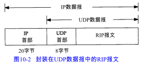
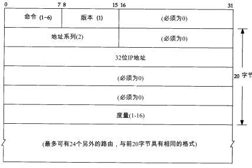

## 静态选路

在配置接口时，以默认方式生成路由表项（对于直接连接的接口），并通过route命令增加表项（通常从系统自引导程序文件），或是通过ICMP重定向生成表项（通常是在默认方式出错的情况下）。

当相邻路由器之间进行通信，以告知对方每个路由器当前所连接的网络，这就出现了动态选路。

# 10.2 动态选路

路由器之间必须采用选路协议进行通信，路由器上有个进程为路由守护程序，它运行选路协议，与相邻路由进行通信。

动态选路并不改变内核在IP层的选路方式。这种选路方式称为选路机制（routingmechanism）。内核搜索路由表，查找主机路由、网络路由以及默认路由的方式并没有改变。仅仅是放置到路由表中的信息改变了----当路由随时间变化时，路由是由路由守护程序动态地增加或删除，而不是来自于自引导程序文件中的route命令。

每个自治系统可以选择该自治系统中各个路由器之间的选路协议。这种协议我们称之为内部网关协议IGP(InteriorGateway Protocol），最常用的IGP是选路信息协议RIP。一种新的IGP是开放最短路径优先OSPF

外部网关协议EGP(Exterier GatewayProtocol）或域内选路协议的分隔选路协议用于不同自治系统之间的路由器。

# 10.3 UNIX选路守护程序

UNIX上运行名为routed的路由守护进程，它只是用RIP进行通信。

另一个程序是gated。IGP和EGP都支持它。大多数系统都可以运行routed，除非需要支持gated所支持的其他协议。

# 10.4 RIP：选路信息协议

让我们来看一下采用RIP协议的routed程序正常运行的结果。RIP常用的UDP端口号是520。

1. 初始化：在启动一个路由守护程序时，它先判断启动了哪些接口，并在每个接口上发送一个请求报文，要求其他路由器发送完整路由表。
2. 接收到请求。如果这个请求是刚才提到的特殊请求，那么路由器就将完整的路由表发送给请求者。否则，就处理请求中的每一个表项：如果有连接到指明地址的路由，则将度量设置成我们的值，否则将度量置为16（度量为16是一种称为“无穷大”的特殊值，它意味着没有到达目的的路由）。然后发回响应。
3. 接收到响应。使响应生效，可能会更新路由表。可能会增加新表项，对已有的表项进行修改，或是将已有表项删除。
4. 定期选路更新。每过30秒，所有或部分路由器会将其完整路由表发送给相邻路由器。发送路由表可以是广播形式的（如在以太网上），或是发送给点对点链路的其他终点的。
5. 触发更新。每当一条路由的度量发生变化时，就对它进行更新。不需要发送完整路由表，而只需要发送那些发生变化的表项。

每条路由都有与之相关的定时器。如果运行RIP的系统发现一条路由在 3分钟内未更新，就将该路由的度量设置成无穷大（16），并标注为删除。这意味着已经在 6个30秒更新时间里没收到通告该路由的路由器的更新了。再过60秒，将从本地路由表中删除该路由，以保证该路由的失效已被传播开。

RIP所使用的度量是以跳(hop)计算的。

# 10.6 OSPF：开放最短路径优先

与采用距离向量的RIP协议不同的是，OSPF是一个链路状态协议。距离向量的意思是，RIP发送的报文包含一个距离向量（跳数）。每个路由器都根据它所接收到邻站的这些距离向量来更新自己的路由表。

在一个链路状态协议中，路由器并不与其邻站交换距离信息。它采用的是每个路由器主动地测试与其邻站相连链路的状态，将这些信息发送给它的其他邻站，而邻站将这些信息在自治系统中传播出去。每个路由器接收这些链路状态信息，并建立起完整的路由表。

OSPF与 RIP（以及其他选路协议）的不同点在于， OSPF直接使用IP。也就是说，它并不使用UDP或TCP。对于ip首部的protocol字段，OSPF有其自己的值。

# 10.7 BGP：边界网关协议

BGP是一种不同自治系统的路由器之间进行通信的外部网关协议。

BGP系统与其他 BGP系统之间交换网络可到达信息。这些信息包括数据到达这些网络所必须经过的自治系统AS中的所有路径。这些信息足以构造一幅自治系统连接图。然后，可以根据连接图删除选路环，制订选路策略。

BGP允许使用基于策略的选路。由自治系统管理员制订策略，并通过配置文件将策略指定给 BGP。与RIP和OSPF不同的是，BGP采用TCP作为其传输层协议。两个运行BGP的系统之间建立一条TCP连接。

BGP是一个距离向量协议，但是与（通告到目的地址跳数的） RIP不同的是，BGP 列举了到每个目的地址的路由。

# 10.8 CIDR：无类型域间选路

无类型域间选路（CIDR）是一个防止Internet路由表膨胀的方法，它也称为超网。

CIDR的基本观点是采用一种分配多个ip地址的方式，使其能够将路由表中的许多表项总和（summarization）成更少的数目。

“无类型”的意思是现在的选路决策是基于整个 32 bit IP地址的掩码操作，而不管其ip地址是A类、B类或是C类，都没有什么区别。