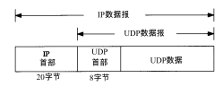
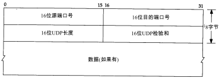
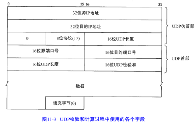
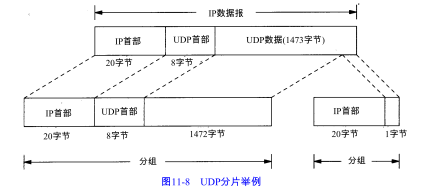
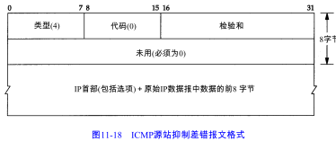

UDP是一个简单的面向数据报的运输层协议

UDP不提供可靠性：它把应用程序传给IP层的数据发送出去，但是并不保证它们能到达目的地。

# 11.2 UDP首部

端口号表示发送进程和接收进程。UDP长度字段指的是UDP首部和UDP数据的字节长度。

# 11.3 UDP检验和

UDP检验和覆盖UDP首部和UDP数据。回想IP首部的检验和，它只覆盖IP的首部。

UDP的检验和是可选的，而TCP的检验和是必需的。

UDP检验和的基本计算方法与IP首部检验和计算方法相类似（16bit字的二进制反码和），但是它们之间存在不同的地方。首先，UDP数据报的长度可以为奇数字节，但是检验和算法是把若干个16bit字相加。解决方法是必要时在最后增加填充字节 0，这只是为了检验和的计算（也就是说，可能增加的填充字节不被传送）。

其次，UDP数据报和TCP段都包含一个12字节长的伪首部，它是为了计算检验和而设置的。伪首部包含 IP首部一些字段。其目的是让 UDP两次检查数据是否已经正确到达目的地。

# 11.5 IP分片

把一份IP数据报分片以后，只有到达目的地才进行重新组装。重新组装由目的端的IP层来完成，其目的是使分片和重新组装过程对运输层（TCP和UDP）是透明的，IP首部中包含的数据为分片和重新组装提供了足够的信息。

对于发送端发送的每份IP数据报来说，其标识字段都包含一个唯一值。该值在数据报分片时被复制到每个片中。标志字段用其中一个比特来表示“更多的片”。除了最后一片外，其他每个组成数据报的片都要把该比特置 1。片偏移字段指的是该片偏移原始数据报开始处的位置。

另外，当数据报被分片后，每个片的总长度值要改为该片的长度值。最后，标志字段中有一个比特称作“不分片”位。如果将这一比特置 1，IP将不对数据报进行分片。相反把数据报丢弃并发送一个ICMP差错报文给起始端。

当IP数据报分片后，每一片都成为一个分组，有自己的IP首部，并在选择路由器时与其他分组独立。固有可能在到达目的端时失序。

一片数据的丢失也要重传整个数据报。因为对数据报分片的是中间路由器，而不是起始端系统，后者根本不知道数据报是如何分片的。 

PS.任何运输层的首部只出现在第一片数据中。

# 11.6 ICMP不可达差错（需要分片）

发送ICMP不可达差错的另一种情况是，当路由器收到一份需要分片的数据报，而在IP首部又设置了不分片（DF）的标志比特。如果某个程序需要判断到达目的端的路途中最小MTU是多少 — 称作路径MTU发现机制，那么这个差错就可以被该程序使用。

# 11.7 用Traceroute 确定路径MTU

修改traceroute程序确定路径MTU：发送分组，设置“不分片”标志比特。发送的第一个分组长度正好与出口MTU相等，每次收到ICMP“不能分片”差错是就减少分组的长度。

# 11.8 采用UDP的路径MTU发现

UDP应用可以关闭或开启该路径MTU发现，只要修改ip_path_mtu_discovery参数即可。

# 11.10 最大 UDP数据报长度

理论上，IP数据报的最大长度是65535字节，这是由IP首部16比特总长度字段所限制的。去除2 0字节的IP首部和8个字节的 UDP首部，UDP数据报中用户数据的最长长度为 65507字节。但是，大多数实现所提供的长度比这个最大值小。

我们会遇到两个限制因素：

1. 应用程序收到其程序接口的限制。比如socket API就可以设置接收和发送缓存的长度
2. 来自TCP/IP的内核实现。

# 11.11 ICMP源站抑制差错

当一个系统（路由器或主机）接收数据报的速度比其处理速度快时，可能产生这个差错。注意限定词“可能”。即使一个系统已经没有缓存并丢弃数据报，也不要求它一定要发送源站抑制报文。

 