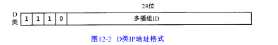

广播是将数据报发送到网络中的所有主机（通常是本地相连的网络），而多播是将数据报发送到网络的一个主机组。

广播和多播仅应用于UDP。

使用广播的问题在于它增加了对广播数据不感兴趣主机的处理负荷。多播的出现减少了对应用不感兴趣主机的处理负荷。使用多播，主机可加入一个或多个多播组。

# 12.2 广播

四种广播地址

1. 受限的广播， 255.255.255.255，该地址用于主机配置过程中IP数据报的目的地址。在任何情况下，路由器都不转发目的地址为受限的广播地址的数据报，这样的数据报仅出现在本地网络中。
2. 指向网络的广播，指向网络的广播地址是主机号为全1的地址。A类网络广播的士为netid.255.255.255。一个路由器必须转发指向网络的广播，但它也有一个不转发的选择。
3. 指向子网的广播，地址为主机号为全 1且有特定子网号的地址。
4. 指向所有子网的广播，需要了解目的网络的子网掩码，以便与指向网络的广播地址区分开。指向所有子网的广播地址的子网号及主机号为全1。

广播是怎样传送的？路由器及主机又如何处理广播？这些问题有赖于广播的类型、应用的类型、TCP/IP实现以及有关路由器的配置。

# 12.4 多播

多播组地址包括为1110的最高4bit和多播组号。它们通常可表示为点分十进制数，范围从224.0.0.0到239.255.255.255 。一个主机组可以跨越多个网络。

通过将其低位 23bit映射到相应以太网地址中便可实现多播组地址到以太网地址的转换。由于地址映射是不唯一的，因此需要其他的协议实现额外的数据报过滤。