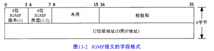

支持主机和路由器进行多播的Internet组管理协议（IGMP）。它让一个物理网络上的所有系统知道主机当前所在的多播组。

IGMP也被当作IP层的一部分。IGMP报文通过IP数据报进行传输。IGMP有固定的报文长度，没有可选数据。

# IGMP报文

# IGMP协议

多播的基础就是一个进程的概念，该进程在一个主机的给定接口上加入了一个多播组。在一个给定接口上的多播组中的成员是动态的 ----它随时因进程加入和离开多播组而变化。

多播路由器使用IGMP报文来记录与该路由器相连网络中组成员的变化情况。使用规则如下：

1)  当第一个进程加入一个组时，主机就发送一个IGMP报告。如果一个主机的多个进程加入同一组，只发送一个IGMP报告。这个报告被发送到进程加入组所在的同一接口上。

2)  进程离开一个组时，主机不发送IGMP报告，即便是组中的最后一个进程离开。主机知道在确定的组中已不再有组成员后，在随后收到的IGMP查询中就不再发送报告报文。

3)  多播路由器定时发送 IGMP查询来了解是否还有任何主机包含有属于多播组的进程。多播路由器必须向每个接口发送一个 IGMP查询。因为路由器希望主机对它加入的每个多播组均发回一个报告，因此 IGMP查询报文中的组地址被设置为 0。

4)  主机通过发送 IGMP报告来响应一个IGMP查询，对每个至少还包含一个进程的组均要发回 IGMP报告。

使用这些查询和报告报文，多播路由器对每个接口保持一个表，表中记录接口上至少还包含一个主机的多播组。当路由器收到要转发的多播数据报时，它只将该数据报转发到（使用相应的多播链路层地址）还拥有属于那个组主机的接口上。