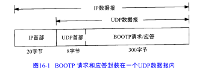
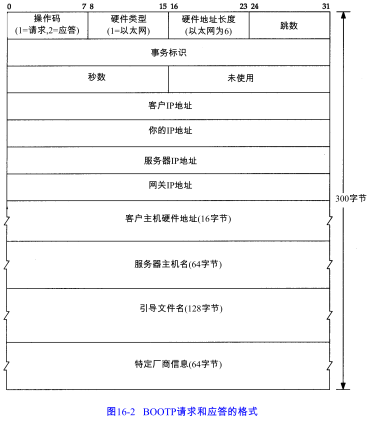

BOOTP使用UDP，且通常需与TFTP协同工作。

# BOOTP 的分组格式

BOOTP有两个熟知端口：BOOTP服务器为67，BOOTP客户为68。这意味着BOOTP客户不会选择未用的临时端口，而只用端口68。选择两个端口而不是仅选择一个端口为BOOTP服务器用的原因是：服务器的应答可以进行广播（但通常是不用广播的）。 

BOOTP服务器比ARP服务器更易于实现，因为BOOTP请求和应答是在UDP数据报中，而不是特殊的数据链路层帧。一个路由器还能作为真正 BOOTP服务器的代理，向位于不同网络的真正BOOTP服务器转发客户的BOOTP请求。RARP是链路层广播，不会被路由器转发。