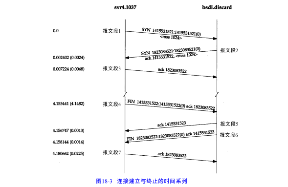
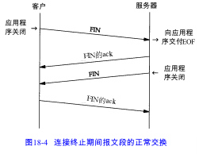
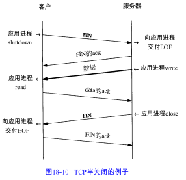
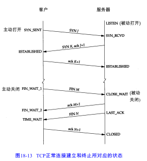
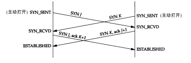
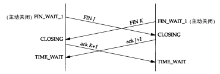
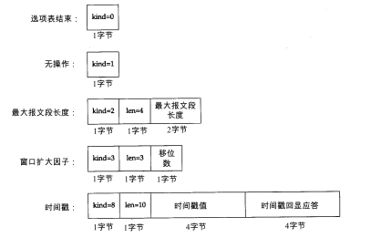

建立一个连接需要三次握手，而终止一个连接要经过4次握手。

为了建立一条TCP连接：

1. 请求端（通常称为客户）发送一个SYN段指明客户打算连接的服务器的端口，以及初始序号。这个 SYN段为报文段1 。
2. 服务器发回包含服务器的初始序号的SYN报文段（报文段2）作为应答。同时，将确认序号设置为客户的ISN加1 以对客户的 SYN报文段进行确认。一个SYN将占用一个序号。
3. 客户必须将确认序号设置为服务器的ISN加1 以对服务器的SYN报文段进行确认（报文段 3）。

# 最大报文段长度

最大报文段长度MSS表示TCP传往另一端的最大块数据的长度。当一个连接建立时，连接的双方都要通告各自的MSS。

MSS让主机限制另一端发送数据报的长度。加上主机也能控制它发送数据报的长度，这将使以较小MTU连接到一个网络上的主机避免分段。

# TCP的半关闭

TCP提供了连接的一端在结束它的发送后还能接收来自另一端数据的能力。

 

# TCP的状态变迁图

# 复位报文段

TCP首部中的RST比特是用于“复位”的。一般说来，无论何时一个报文。段发往基准的连接（ referenced connection）出现错误，TCP都会发出一个复位报文段（这里提到的“基准的连接”是指由目的 I P地址和目的端口号以及源 I P地址和源端口号指明的连接）。

产生复位的一种常见情况是当连接请求到达时，目的端口没有进程正在听。对于 UDP，我们在6 . 5 节看到这种情况，当一个数据报到达目的端口时，该端口没在使用，它将产生一个 I C M P端口不可达的信息。而 TCP则使用复位。

异常终止一个连接，或者检测半打开连接都需要发送一个复位报文段。

# 同时打开

两个应用程序同时彼此执行主动打开的情况是可能的。每一方必须发送一个SYN，且这些SYN 必须传递给对方。这需要每一方使用一个对方熟知的端口作为本地端口。这又称为同时打开。

# 同时关闭

# TCP选项

 