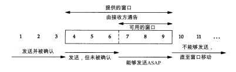

TCP所使用的被称为滑动窗口协议的另一种形式的流量控制方法。该协议允许发送方在停止并等待确认前可以连续发送多个分组。由于发送方不必每发一个分组就停下来等待确认，因此该协议可以加速数据的传输。

# 滑动窗口

发送方计算它的可用窗口，该窗口表明多少数据可以立即被发送。 

我们使用三个术语来描述窗口左右边沿的运动：

1. 称窗口左边沿向右边沿靠近为窗口合拢。这种现象发生在数据被发送和确认时。
2. 当窗口右边沿向右移动时将允许发送更多的数据，我们称之为窗口张开。这种现象发生在另一端的接收进程读取已经确认的数据并释放了 TCP的接收缓存时。
3. 当右边沿向左移动时，我们称之为窗口收缩。

# 窗口大小

由接收方提供的窗口的大小通常可以由接收进程控制，这将影响TCP的性能。

# PUSH标志

发送方使用PUSH标志通知接收方将所收到的数据全部提交给接收进程。这里的数据包括与PUSH一起传送的数据以及接收方 TCP已经为接收进程收到的其他数据。

# 慢启动

TCP需要支持一种被称为“慢启动 (slowstart)”的算法。该算法通过观察到新分组进入网络的速率应该与另一端返回确认的速率相同而进行工作。

慢启动为发送方的TCP增加了另一个窗口：拥塞窗口 (congestion window)，记为cwnd 。

发送方取拥塞窗口与通告窗口中的最小值作为发送上限。拥塞窗口是发送方使用的流量控制，而通告窗口则是接收方使用的流量控制

# 紧急方式

TCP提供了“紧急方式 ( urgent mode) ”，它使一端可以告诉另一端有些具有某种方式的“紧急数据”已经放置在普通的数据流中。另一端被通知这个紧急数据已被放置在普通数据流中，由接收方决定如何处理。

只要从接收方当前读取位置到紧急数据指针之间有数据存在，就认为应用程序处于“紧急方式”。