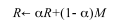
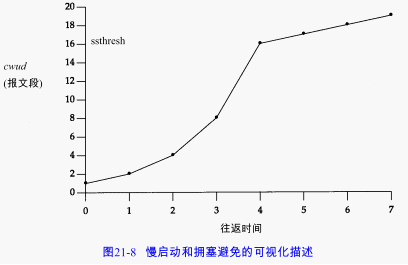

对每个连接，TCP管理4个不同的定时器：

1)  重传定时器使用于当希望收到另一端的确认。
2)  坚持(persist)定时器使窗口大小信息保持不断流动，即使另一端关闭了其接收窗口。
3)  保活( keepalive )定时器可检测到一个空闲连接的另一端何时崩溃或重启。这个定时器。
4)  2MSL定时器测量一个连接处于TIME_WAIT状态的时间。

# 往返时间测量

首先TCP必须测量在发送一个带有特别序号的字节和接收到包含该字节的确认之间的RT T。最初的TCP规范使TCP使用低通过滤器来更新一个被平滑的RTT估计器：

**Karn算法**：当一个超时和重传发生时，在重传数据的确认最后到达之前，不能更新RTT估计器，因为我们并不知道ACK对应哪次传输。

# 拥塞避免算法

拥塞避免算法和慢启动算法需要对每个连接维持两个变量：一个拥塞窗口cwnd和一个慢启动门限ssthresh。这样得到的算法的工作过程如下：

1) 对一个给定的连接，初始化cwnd为1个报文段，ssthresh为65535个字节。
2) TCP输出例程的输出不能超过 cwnd和接收方通告窗口的大小。拥塞避免是发送方使用的流量控制，而通告窗口则是接收方进行的流量控制。前者是发送方感受到的网络拥塞的估计，而后者则与接收方在该连接上的可用缓存大小有关。
3)  当拥塞发生时（超时或收到重复确认），ssthresh被设置为当前窗口大小的一半（cwnd和接收方通告窗口大小的最小值，但最少为 2个报文段）。此外，如果是超时引起了拥塞，则cwnd被设置为1个报文段（这就是慢启动）。
4)  当新的数据被对方确认时，就增加 cwnd，但增加的方法依赖于我们是否正在进行慢启动或拥塞避免。如果 cwnd小于或等于ssthresh，则正在进行慢启动，否则正在进行拥塞避免。慢启动一直持续到我们回到当拥塞发生时所处位置的半时候才停止（因为我们记录了在步骤2中给我们制造麻烦的窗口大小的一半），然后转为执行拥塞避免。
	
慢启动算法初始设置 cwnd为1个报文段，此后每收到一个确认就加 1。那样，这会使窗口按指数方式增长：发送 1个报文段，然后是2个，接着是4个......

拥塞避免算法要求每次收到一个确认时将 cwnd增加1 /cwnd。与慢启动的指数增加比起来，这是一种加性增长(additive increase)。我们希望在一个往返时间内最多为 cwnd增加1个报文段（不管在这个RT T中收到了多少个ACK），然而慢启动将根据这个往返时间中所收到的确认的个数增加cwnd。

# 快速重传与快速恢复算法

这个算法通常按如下过程进行实现：

1)  当收到第3个重复的ACK时，将ssthresh设置为当前拥塞窗口cwnd的一半。重传丢失的报文段。设置cwnd为ssthresh加上3倍的报文段大小。
2)  每次收到另一个重复的 ACK时，cwnd增加1个报文段大小并发送 1个分组（如果新的cwnd允许发送）。
3) 当下一个确认新数据的ACK到达时，设置cwnd为ssthresh（在第1步中设置的值）。这个ACK应该是在进行重传后的一个往返时间内对步骤 1中重传的确认。另外，这个 ACK也应该是对丢失的分组和收到的第1个重复的ACK之间的所有中间报文段的确认。这一步采用的是拥塞避免，因为当分组丢失时我们将当前的速率减半。

# ICMP的差错

TCP能够遇到的最常见的ICMP差错就是源站抑制、主机不可达和网络不可达。当前基于伯克利的实现对这些错误的处理是：

1. 一个接收到的源站抑制引起拥塞窗口cwnd被置为1个报文段大小来发起慢启动，但是慢启动门限ssthresh没有变化，所以窗口将打开直至它或者开放了所有的通路（受窗口大小和往返时间的限制）或者发生了拥塞。
2. 一个接收到的主机不可达或网络不可达实际上都被忽略，因为这两个差错都被认为是短暂现象。