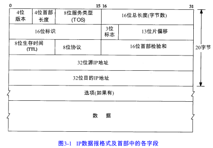
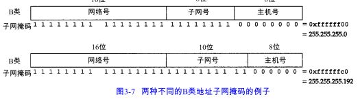
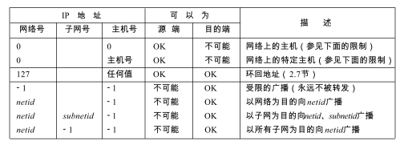

IP提供的是不可靠、无连接的数据报传送服务：

1. 不可靠的意思是它不能保证IP数据报能成功地到达目的地。IP仅提供最好的传输服务。如果发生某种错误时，如某个路由器暂时用完了缓冲区，IP有一个简单的错误处理算法：丢弃该数据报，然后发送ICMP消息报给信源端。任何要求的可靠性必须由上层来提供（如TCP）。
2. 无连接的意思是IP并不维护任何关于后续数据报的状态信息。每个数据报的处理是相互独立的。这也说明，IP数据报可以不按发送顺序接收。

# 3.2 IP首部

传输数据之前把首部转换成网络字节序：注意大端和小端。

首部长度 指的是首部占32 bit字的数目，包括任何选项。由于它是一个4比特字段，因此首部最长为60个字节。

服务类型（TOS）字段包括一个3 bit的优先权子字段（现在已被忽略），4 bit的TOS子字段和 1 bit未用位但必须置0。4 bit的TOS分别代表：最小时延、最大吞吐量、最高可靠性和最小费用。

总长度字段 是指整个IP 数据报的长度，以字节为单位。由于该字段长16比特，所以IP数据报最长可达65535字节。

标识字段 唯一地标识主机发送的每一份数据报。

TTL（time - to - live）生存时间字段设置了数据报可以经过的最多路由器数。TTL初始值由源主机设置，一旦经过一个处理它的路由器，它的值就减去1。当值为0时，数据报被丢弃，并发送ICMP报文通知源主机。

首部检验和字段 是根据IP首部计算的检验和码。它不对首部后面的数据进行计算。

最后一个字段是任选项，是可变长的可选信息，定义如下：

- 安全和处理限制
- 记录路径（让每个路由器都记下它的IP）
- 时间戳（让每个路由都记下它的IP地址和时间）
- 宽松/严格的源站选录

# 3.3 IP路由选择

IP可以从TCP、UDP、ICMP、IGMP接收数据报（即在本地生成的），或者从一个网络接口接收数据报（待转发的）并进行发送。IP层在内存中有个路由表。当收到一份数据报时，它都检索一次表。当数据报来自某个网络接口时，IP首先检查目的IP地址是否为本机的IP地址之一或者IP广播地址。如果是，数据报就被送到由IP首部协议字段所指定的协议模块进行处理。如果数据报目的地址不是这些地址，那么

1. 如果IP蹭被设置成路由器的功能，那么就对数据报进行转发，否则
2. 丢弃数据报

路由表中的每一项都包含下面这些信息：

1. 目的IP地址。它既可以是一个完整的主机地址，也可以是一个网络地址，由该表目中的标志字段来指定（如下所述）。
2. 下一站（或下一跳）路由器（next-hop router）的I P 地址，或者有直接连接的网络IP地址。
3. 标志。其中一个标志指明目的 IP地址是网络地址还是主机地址，另一个标志指明下一站路由器是否为真正的下一站路由器，还是一个直接相连的接口。
4. 为数据报的传输指定一个网络接口。

IP路由选择是逐跳地进行的。从路由表信息可以看出，IP并不知道到达任何目的的完整路径（当然，除了那些与主机直接相连的目的）。所有的IP路由选择只为数据报传输提供下一站路由器的IP地址。 

IP路由选择主要完成以下这些功能：

1) 搜索路由表，寻找能与目的IP地址完全匹配的表目 （网络号和主机号都要匹配）。如果找到，则把报文发送给该表目指定的下一站路由器或直接连接的网络接口（取决于标志字段的值）。

2)搜索路由表，寻找能与目的网络号相匹配的表目 。如果找到，则把报文发送给该表目指定的下一站路由器或直接连接的网络接口（取决于标志字段的值）。目的网络上的所有主机都可以通过这个表目来处置。例如，一个以太网上的所有主机都是通过这种表目进行寻径的。这种搜索网络的匹配方法必须考虑可能的子网掩码。

3) 搜索路由表，寻找标为“默认”的表目。如果找到，则把报文发送给该表目指定的下一站路由器。

如果上述步骤都没有成功，那么该数据报就不能被发送。

Attention：

- 数据报中的目的IP地址始终不发生任何变化。

- 每个链路层可能具有不同的数据帧首部，而且链路层的目的地址（如果有的话）始终指的是下一站的链路层地址。

# 3.4 子网寻址

子网编址，是把主机号再分成一个子网号和一个主机号。

由于全0或全1 的主机号都是无效的。

子网对于子网内部的路由器是不透明的。

# 3.5 子网掩码

这个掩码是一个 32 bit的值，其中值为1的比特留给网络号和子网号，为 0的比特留给主机号。

给定IP地址和子网掩码以后，主机就可以确定IP数据报的目的是：

1. 本子网上的主机； 
2. 本网络中其他子网中的主机； 
3. 其他网络上的主机。

# 3.6 特殊情况的 IP地址

  