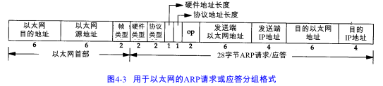

当一台主机把以太网数据帧发送到位于同一局域网上的另一台主机时，是根据48bit的以太网地址来确定目的接口的。ARP为IP地址到对应的硬件地址之间提供动态映射。

ARP发送一份称作ARP请求的以太网数据帧给以太网上的每个主，这个过程称为“广播”。ARP请求数据帧中包含目的主机的IP地址。如果你是这个IP地址的拥有者，请回答你的硬件地址。

目的主机的ARP层收到这份广播后，识别出自己的IP地址，于是发送一个ARP应答，这个应答包含IP死Hi和对应的硬件地址。收到ARP应答后，使ARP进行请求- 应答交换的IP数据报现在就可以传送了。

点对点链路不使用ARP。当设置这些链路时（一般在引导过程进行），必须告知内核链路每一端的IP地址。像以太网地址这样的硬件地址并不涉及。

# 4.3 ARP高速缓存

ARP高效运行的关键是由于每个主机上都有一个ARP高速缓存。这个高速缓存存放了最近Internet地址到硬件地址之间的映射记录。

arp 命令用来检查ARP高速缓存：

➜  arp -a

 (192.168.100.1) at7c:8:d9:87:e5:85 on en0 ifscope [ethernet]

 (192.168.100.255) at(incomplete) on en0 ifscope [ethernet]

# 4.4 ARP分组格式

目的地址为全1的特殊地址是广播地址。

# 4.6 ARP代理

如果ARP请求是从一个网络的主机发往另一个网络上的主机，那么连接这两个网络的路由器就可以回答该请求，这个过程称作委托 ARP或ARP代理（ProxyARP）。

ARP代理的其他用途：通过两个物理网络之间的路由器可以互相隐藏物理网络。

# 4.7 免费ARP

免费ARP：主机发送ARP查找自己的IP地址。这一般发生在系统引导期间。

免费ARP可以有两个方面的作用：

1)  一个主机可以通过它来确定另一个主机是否设置了相同的IP地址。

2)  如果发送ARP的主机正好改变了硬件地址，那么这个分组就可以使其他主机高速缓存中旧的硬件地址进行相应的更新。