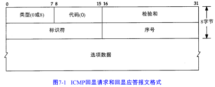
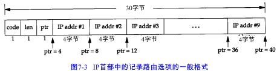
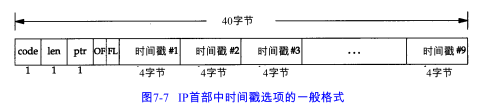

ping程序，目的是为了测试另一台主机是否可达。该程序发送一份ICMP回显请求报文给主机，并等待返回ICMP回显应答，不用经过传输层TCP/UDP。

一般来说，如果不能Ping到某台主机，那就不能telnet活ftp到它。但是一台主机的可泰兴不只取决于IP层是否可达，还取决于使用何种协议和端口号。Ping的结果可能显示某台主机不可达，但可以用Telnet远程登录该主机的25号端口。

# 7.2 Ping程序

UNIX在实现ping时，把ICMP报文中的标识符设置成发送进程的PID。这样就可以同时运行多个ping程序。

ping程序通过在ICMP报文数据中存放发送请求的时间值来计算往返时间。当应答返回时，用当前时间减去存放在ICMP报文中的时间值，即是往返时间。

# 7.3 IP记录路由选项

大多数不同版本的ping程序都提供-R选项，以提供记录路由的功能。

它使得ping程序在发送出去的IP数据报中设置IP RR选项（该IP数据报包含ICMP回显请求报文）。这样， 每个处理该数据报的路由器都把它的 IP地址放入选项字段中。当数据报到达目的端时，IP地址清单应该复制到ICMP回显应答中，这样返回途中所经过的路由器地址也被加入清单中。当ping程序收到回显应答时，它就打印出这份IP地址清单。

IP首部有它的长度限制，所以只能存放9个IP地址。

# 7.4 IP时间戳选项

 