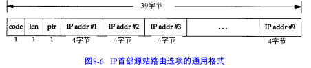

traceroute程序可以让我们看到IP数据报从一台主机传到另一台主机所经过的路由。traceroute程序还可以让我们使用IP源路由选项。

# 8.2 Traceroute程序的操作

为什么不使用IP记录路由选项（RR）而另外开发一个新的traceroute？

1. 原先并不是所有的路由器都支持记录路由选项
2. 记录路由一般是单向的选项
3. IP首部中留给选项的空间有限，不能存放当前大多数的路径

traceroute程序使用ICMP报文和IP首部中的TTL字段。TTL字段是由发送端初始设置一个8bit字段。推荐的初始值由分配数字RFC指定，当前值为64。

每个处理数据报的路由器都需要把TTL的值减1 或减去数据报在路由器中停留的秒数。由于大多数的路由器转发数据报的时延都小于1秒钟，因此TTL最终成为一个跳站的计数器，所经过的每个路由器都将其值减1。

TTL字段的目的是防止数据报在选路时无休止地在网络中流动。当路由器收到一个IP数据报，TTL是0或1，丢弃该数据报，并给信源发送一份ICMP超时信息。Traceroute的关键在于包含这份ICMP信息的IP报文的信源地址是该路由器的IP地址。

所以Traceroute的操作过程是：先发送一份TTL字段为1的IP数据报给目的主机，得到第一个路由器的地址；然后发送一个TTL字段为2的IP数据报，以此类推，直到达到目的主机。

# 8.5 IP源站选路选项

源站选路(source routing) 的思想是由发送者指定路由。它可以采用以下两种形式：

1. 严格的源路由选择。发送端指明IP数据报所必须采用的确切路由。如果一个路由器发现源路由所指定的下一个路由器不在其直接连接的网络上,那么它就返回一个“源站路由失败”的ICMP差错报文。
2. 宽松的源站选路。发送端指明了一个数据报经过的IP地址清单，但是数据报在清单上指明的任意两个地址之间可以通过其他路由器。

源站路由选项的实际称呼为“源站及记录路由”（对于宽松的源站选路和严格的源站选路，分别用 LSRR和SSRR 表示），这是因为在数据报沿路由发送过程中，对 IP地址清单进行了更新。下面是其运行过程：

1. 发送主机从应用程序接收源站路由清单，将第1表项去掉（它是数据报的最终目的地址），将剩余的项移到1个项中，并将原来的目的地址作为清单的最后一项。指针仍然指向清单的第 1项（即，指针的值为4）。
2. 每个处理数据报的路由器检查其是否为数据报的最终地址。如果不是，则正常转发数据报（在这种情况下，必须指明宽松源站选路，否则就不能接收到该数据报）。
3. 如果该路由器是最终目的，且指针不大于路径的长度，那么 ( 1)由ptr 所指定的清单中的下一个地址就是数据报的最终目的地址； (2)由外出接口(outgoing interface) 相对应的 I P地址取代刚才使用的源地址； (3)指针加4 。