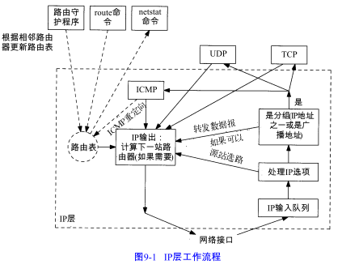
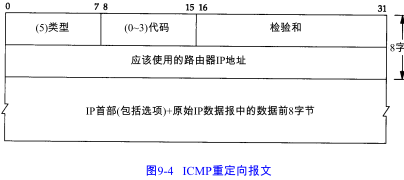
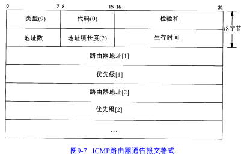

# 9.2 选路的原理

IP搜索路由表的几个步骤：

1) 搜索匹配的主机地址；

2) 搜索匹配的网络地址；

3) 搜索默认表项

IP层进行的选路实际上是一种选路机制，它搜索路由表并决定向哪个网络接口发送分组。这区别于选路策略，它只是一组决定把哪些路由放入路由表的规则。IP执行选路机制，而路由守护程序则一般提供选路策略。

每当初始化一个接口时（通常用ifconfig设置接口地址），就为接口自动创建一个直接路由。到达不直接相连的主机或网络必须以某种方式添加到路由表中，一个常用方式是：

1. 在系统引导时显式地在初始化文件中运行route命令
2. 运行路由守护程序。或者用较新的路由器发现协议

如果路由表中没有默认项，又没有找到匹配项，结果取决于该IP数据报是由主机产生还是被转发的。如果是本机产生的，那么久给发送该数据报的应用程序返回一个差错，或者是“主机不可达差错”或者“网络不可达差错”。如果是被转发的数据报，那么就给原始发送端发送一份ICMP主机不可达的差错报文。

# 9.3 ICMP主机与网络不可达差错

当路由器收到一份IP数据报但又不能转发时，就要发送一份ICMP“主机不可达”差错报文。

# 9.4 转发或不转发

一般都假定主机不转发IP数据报，除非对它们进行特殊配置而作为路由器使用。

大多数伯克利派生出来的系统都有一个内核变量ipforwarding，或其他类似的名字。一些系统（如BSD/386和SVR4）只有在该变量值不为0的情况下才转发数据报。

# 9.5 ICMP重定向差错

当IP数据报应该被发送到另一个路由器时，收到数据报的路由器就要发送ICMP重定向差错报文给IP数据报的发送端。

重定向一般用来让具有很少选路信息的主机逐渐建立更完善的路由表。主机启动时路由表中可以只有一个默认表项。一旦默认路由发生差错，默认路由器将通知它进行重定向，并允许主机对路由表作相应的改动。

 重定向报文有许多规则：

1. 重定向报文只能由路由器生成，不能由主机生成
2. 重定向报文是为主机而不是路由器使用的
3. 路由器发应该发送的是对主机的重定向，而不是对网络的重定向。因为子网的存在使得难于准确指明何时应发送对网络的重定向。

# 9.6 ICMP路由器发现报文

在本章前面已提到过一种初始化路由表的方法，即在配置文件中指定静态路由（Route命令）。这种方法经常用来设置默认路由。另一种新的方法是利用ICMP路由器通告和请求报文。

主机在引导后会广播/多播一份路由器请求报文。另外，路由器会定期广播/多播传送他们的路由器通告报文，允许每个正在监听的主机更新它们的路由表。

 

 ## 路由器操作

当路由器启动时，它定期（一般不是定义，随机传送的，减少冲突）在所有广播或多播传送接口上发送通告报文。路由器还要监听来自主机的请求报文，并发送路由器通告报文以响应这些请求报文。

## 主机操作

主机在引导期间一般发送三份路由器请求报文，每三秒钟发送一次。一旦接收到一个有效的通告报文，就停止发送请求报文。

主机也监听来自相邻路由器的请求报文。这些通告报文可以改变主机的默认路由器。另外，如果没有接收到来自当前默认路由器的通告报文，那么默认路由器会超时。

路由器发现报文一般由用户进程（守护程序）创建和处理。